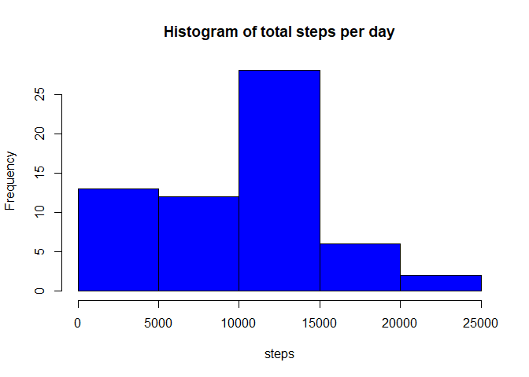
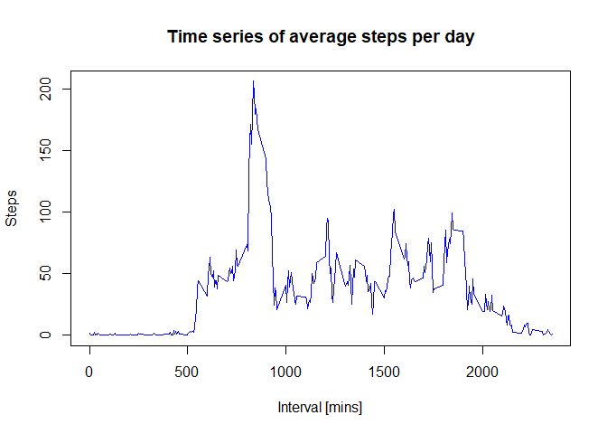
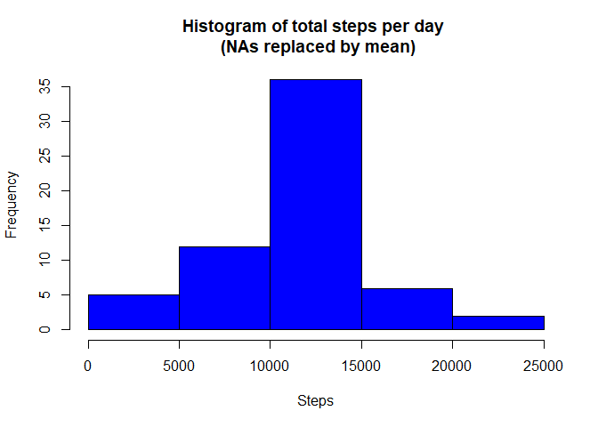
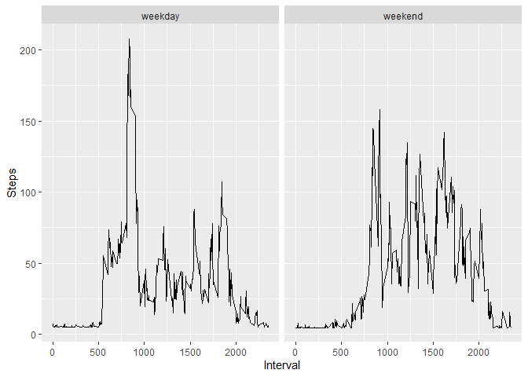

## Loading and preprocessing the data


```r
# Unzips and loads the csv data into R
unzip("activity.zip")
activity <- read.csv("activity.csv")

# Sets the format as Date type
activity$date <- as.Date(activity$date)
```


## What is mean total number of steps taken per day?
1. Histogram of total steps per day

At first, the total steps per date is calculated. Then, the histogram is generated.


```r
totalSteps <- aggregate(activity$steps, by = list(activity$date), FUN= sum, na.rm=TRUE)
colnames(totalSteps) <- c("Day", "Total.Steps")

hist(totalSteps$Total.Steps,
     main="Histogram of total steps per day",
     xlab= "steps",
     col= "blue")
```

<!-- -->

2. Mean and median of steps (NAs removed)


```r
mean(totalSteps$Total.Steps)
```

```
## [1] 9354.23
```

```r
median(totalSteps$Total.Steps)
```

```
## [1] 10395
```


## What is the average daily activity pattern?
1. Time series plot of average activity by interval


```r
avgByInterval <- aggregate(activity$steps, by=list(activity$interval), FUN=mean, na.rm=TRUE)
colnames(avgByInterval) <- c("Interval", "Steps")
plot(avgByInterval, type= "l", col="blue",
     main="Time series of average steps per day",
     xlab="Interval [mins]",
     ylab="Steps")
```

<!-- -->
2. Maximum number of steps in a single interval


```r
avgByInterval$Interval[avgByInterval$Steps==(max(avgByInterval$Steps))]
```

```
## [1] 835
```


## Imputing missing values

1. Total number of missing values


```r
sum(is.na(activity$steps))
```

```
## [1] 2304
```

2. Replace NAs by the mean of steps


```r
activity$steps[is.na(activity$steps)] <- mean(activity$steps, na.rm=TRUE)
```

3. Create a new dataset with the missing data filled in


```r
filled_activity <- activity
filled_activity$steps[is.na(filled_activity$steps)] <- mean(activity$steps, na.rm=TRUE) 
```

4.Histogram of steps taken per day (missing values replaced)


```r
filledTotalSteps <- aggregate(filled_activity$steps, by = list(filled_activity$date), FUN= sum, na.rm=TRUE)
colnames(filledTotalSteps) <- c("Day", "Total.Steps")

hist(filledTotalSteps$Total.Steps,
     main="Histogram of total steps per day \n (NAs replaced by mean)",
     xlab= "Steps",
     col= "blue")
```

<!-- -->

```r
mean(filledTotalSteps$Total.Steps)
```

```
## [1] 10766.19
```

```r
median(filledTotalSteps$Total.Steps)
```

```
## [1] 10766.19
```

## Are there differences in activity patterns between weekdays and weekends?

1. Create new variable "weekend" or "weekday"

```r
filled_activity$days <- weekdays(filled_activity$date)
filled_activity$dayPattern <- ifelse(filled_activity$days=="sábado" | filled_activity$days=="domingo", "weekend", "weekday")
avgByDayPattern <- aggregate(filled_activity$steps, by=list(filled_activity$interval, filled_activity$dayPattern), FUN=mean, na.rm= TRUE)
colnames(avgByDayPattern) <- c("Interval", "Day.Pattern", "Steps")
```

2. Make a panel plot with time-series for weekends and weekdays


```r
library(ggplot2)
```

```
## Warning: package 'ggplot2' was built under R version 4.0.2
```

```r
ggplot(aes(x=Interval,y=Steps),data=avgByDayPattern)+geom_line()+facet_wrap(~avgByDayPattern$Day.Pattern)
```

<!-- -->
